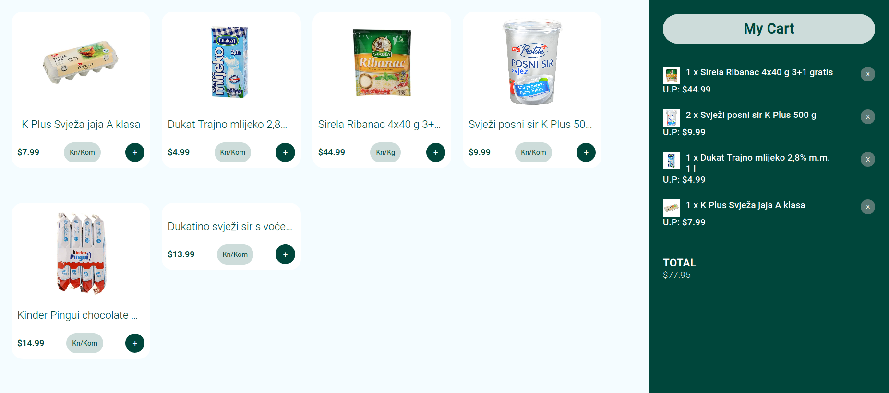

# Kosarica

Esta aplicacion recibe informacion del archivo "products.json" para listar los productos. Al hacer clic en el botón "Agregar", el producto seleccionado se agrega al carrito, el cual contiene una lista de todos los productos agregados y el monto total
Una vez agregado, el producto se puede eliminar del carrito
Se puede agregar un producto al carrito más de una vez.

## Preview

## Instrucciones

Para instalar el project realice las siguientes instrucciones:

- Click en ***code*** y "clone with SSH"
- Ir a la ruta donde desee guardar el proyecto
- Abrir su terminal, escribir **git init** y presionar enter
- Escribir **git clone** -*copiar el link pegado del primer paso*- y enter
- Finalmente abrir el proyecto con su IDE (e.g: Visual Studio Code)
- Abra el terminal desde su proyecto
- Escriba 'npm start' y enter

## Herramientas utilizadas

- Node.js
- React
- React-DOM
- [React-Create-App](https://github.com/facebook/create-react-app)
- Redux 
- npm
- CSS
- ES6

## Live Demo

[Live Demo Version](https://bren2102-moviedate.herokuapp.com/Movies)

## Autor

👤 **Brenda Yucra**

- Github: [@bren2102](https://github.com/bren2102)
- Linkedin: [Brenda Yucra](https://www.linkedin.com/in/brenda-yucra/)

## 🤝 Contributing

Contributions, issues and feature requests are welcome!

Feel free to check the [issues page](https://github.com/bren2102/MovieDate/issues).

## Show your support

Give a ⭐️ if you like this project!